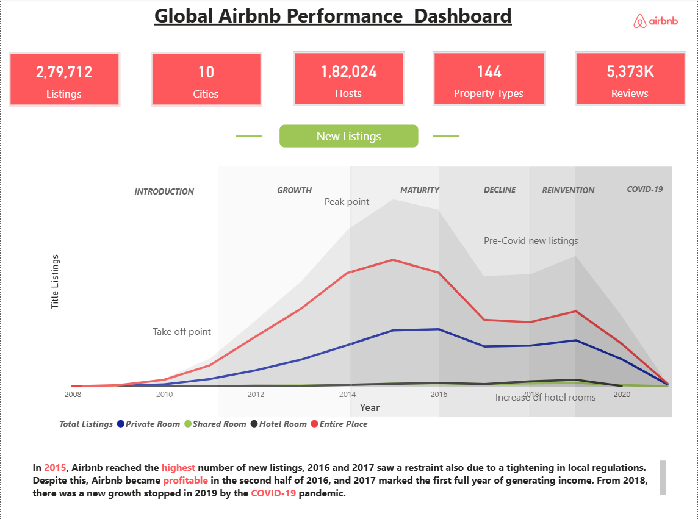
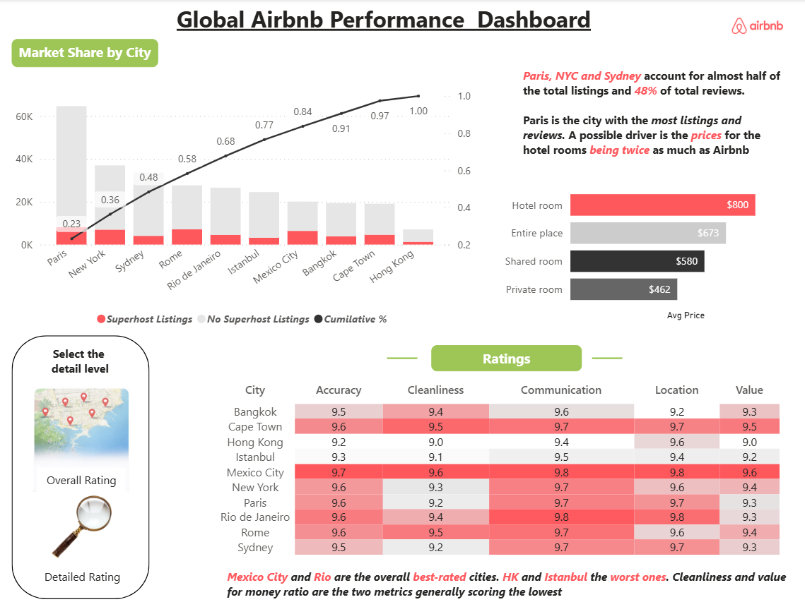
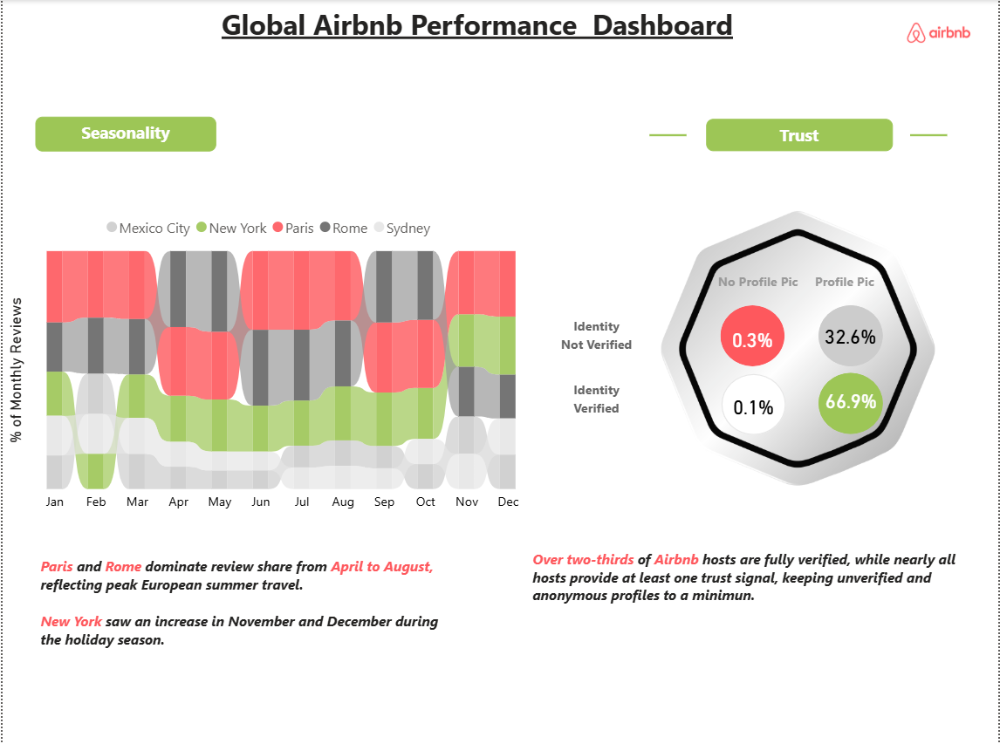

# Global Airbnb Dashboard

## 📌 Project Overview

This project delivers an end-to-end analysis of Airbnb’s global marketplace using an interactive Power BI dashboard. It focuses on uncovering trends in listings growth, pricing dynamics, customer engagement, and market concentration to support data-driven decision-making.

---

## 🎯 Business Objectives

* Analyze historical growth trends in Airbnb listings
* Identify high-performing cities and market concentration
* Evaluate pricing patterns across property types
* Assess customer satisfaction through ratings and reviews
* Examine seasonal demand fluctuations

---

## 🛠 Technology Stack

* Power BI — Data Visualization & Dashboard Development
* Microsoft Excel — Data Cleaning & Transformation

---

## 📊 Key Business Insights

* Analyzed ~279K+ listings across multiple global cities to identify growth and demand patterns
* Top 3 cities contribute ~48% of total reviews, indicating strong market concentration
* Hotel room listings command the highest average price (~$800), highlighting premium segment demand
* Customer ratings remain consistently high (~9.0+), reflecting strong user satisfaction
* Over 66% of hosts are verified, reinforcing platform trust and reliability
* Peak demand observed during mid-year months, aligning with global travel seasonality

---

## 💼 Business Value

This analysis enables stakeholders to:

* Identify high-demand markets for expansion
* Optimize pricing strategies across property segments
* Understand customer behavior and satisfaction drivers
* Improve trust and engagement on the platform
* Leverage seasonal trends for revenue optimization

---

## 📷 Dashboard Snapshots

### Global Airbnb Dashboards

#### 1. Overview Dashboard

#### 2. Market Share & Ratings

#### 3. Seasonality & Trust

---

## 📁 Data Sources

Due to large file sizes, a representative sample dataset is included:

* `listings_sample.csv` — Property-level data (pricing, location, attributes)
* `reviews_sample.csv` — Sample customer review data
* `listings_dictionary.csv` — Metadata for listings dataset
* `reviews_dictionary.csv` — Metadata for reviews dataset

---

## ▶️ How to Use

1. Download the dashboard using the link below
2. Open the file in Power BI Desktop
3. Use filters to explore city-wise trends, pricing variations, and seasonal patterns

---

## 📥 Access Full Dashboard

👉 [View Power BI Dashboard] https://drive.google.com/file/d/1R6Oe-S1WCjhxlk8wKjyJVwkXIFJNo8zM/view?usp=drive_link

---

## 🚀 Project Outcome

The project provides a structured view of Airbnb’s marketplace, enabling deeper understanding of pricing strategies, geographic performance, and customer engagement. It demonstrates the application of data analytics in solving real-world business problems.

---

## 👤 Author

**Daman Komu**
GitHub: https://github.com/damankomu21
